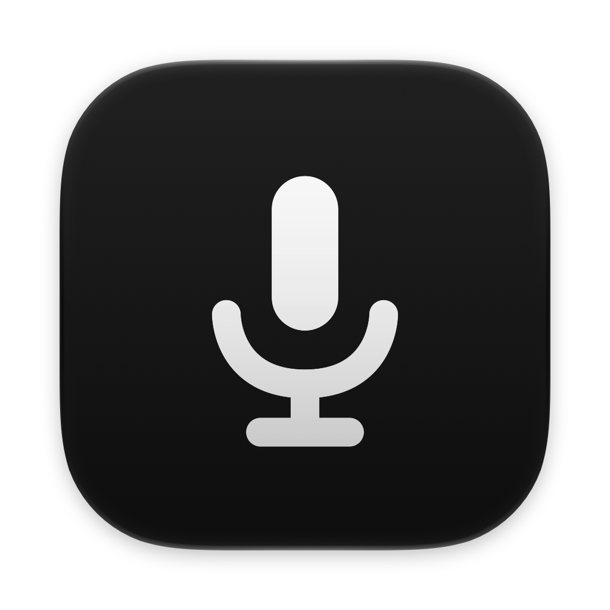

<div align="center">
    
</div>

<h1 id="scriber" align="center">Scriber</h1>

<p align="center">
    <a href="#install"><b>Install ↓</b></a><br>
    <sub><i>macOS 26+</i></sub>
</p>
<br />

If you're looking for a macOS dictation app to daily-drive, you may be interested in checking out [these alternatives I've listed below](#better-alternatives).

## About

I asked Codex and Claude to build a Wispr Flow alternative (didn't like its RAM usage). It turns out to be good enough that I uninstalled the others for the time being.

**Scriber** is a native macOS dictation app that lives in the menu bar by default, built with Swift, SwiftUI, and AppKit. Let me rephrase: Scriber is an ElevenLabs Scribe v2 API wrapper written in Swift that works just like Wispr Flow (kinda).

- **~66-100MB of RAM usage when idle** (depending on how many saved dictations you have in history; sitting comfortably at ~80-90MB with ~1900 rows).
- **<5MB of bundle size** (native Swift app).
- **BYOK** (only supports **ElevenLabs**, for now; **not a privacy-focused option**).
- **Paste-fail detection** (jargon-y enough?)
    - like Wispr Flow, it notifies and copies the dictation to clipboard when pasting fails.
    - known quirk: [x.com](https://x.com) often consumes pasted text even when no text box is focused, so Scriber may often fail to detect paste failures (Wispr Flow also does in this scenario, so...). haven't found any other pasting "false-positive" scenario in apps and web apps I use.
- Dictation history + **recoverable** failed and canceled dictations.
- No feature bloat (no "stats", not even post-pro, not until any other provider is supported...).

## Why ElevenLabs?

Its Scribe v2 model is not just benchmark-accurate (lowest WER in the world at some point), but also covers my personal use cases:

- handles Bahasa Indonesia well, even when quickly code-switching between it and English (a.k.a. *Jaksel-friendly*. Whisper does this too, but only to a certain extent with less accuracy). Local models, even excellent ones like **Parakeet**, often have limited support of languages (capped at 10 or 25 instead of 99, no Bahasa).
- knows way more key terms and phrases internally than other providers like Deepgram and local models (less editing).
- generous free monthly credits (for non-heavy dictation users like me, 10k credits, which equals 2h30m of transcription via API, is more than enough; I usually spend around 5k-8k credits/month).
- auto-punctuation, filler-word removal, and (slight) grammar correction work so well that it doesn't need any post-processing at all in most cases.

## Why not local models?

I'm on a base model macbook. Running a local model means:

- Downloading 1+++GB model if I want a bigger model for better accuracy and more language coverage.
- or sticking with small models (like Parakeet or Whisper small, or Apple's built-in): don't have auto-language detection and are either less accurate, slow, not supporting my language, or combination of them (if only Parakeet v3 supports Bahasa and code-switching and maintaining its speed... that'd be a dream).
- Using a lot of memory when transcribing (from a couple hundred of MBs up to 4gigs with bigger, more accurate models). I have experienced a freeze on my macbook air m4 base when other resource-heavy apps are running.
- I don't dictate private or incriminating information (for now...); I just type it (not the incriminating one) or use pw manager's auto-fill for that, so I'm not worried my dictation being processed somewhere on a server.

## (Better) Alternatives...

I've been using Scriber for weeks, and it fits my simple needs just fine. While I might keep maintaining it (read: report bugs and ask for features & improvements to the clankers), I most likely don't have enough tokens to squash bugs and fulfill requests as much/as quick as an actual project with an actual dev. So here are my recommended alternatives and open source options you might want to also check out:

<details>
    <summary><strong>Alternatives</strong></summary>

### [Wispr Flow](https://wisprflow.ai/)

Seriously, if you're okay with its privacy policy (just got updated after the new Notetaker feature shipped; and not bothered with its current contro around privacy), and how it may use ~500MB–1GB of your RAM even when idle, just use Wispr Flow

- it's a "trend-setter" and used by many for a reason
- great ux, great onboarding, easy to use
- good accuracy+speed balance, and rather reliable cleanup post-processing
- free users get 2000 words/week on desktop, 1000 words/week on mobile. more than enough for many
- iOS and Android apps available (and afaik, syncs with all your devices if you subscribe); even though on Android, some secure (mobile banking) apps can't be accessed while its accessibility access is active (which is needed)
- aside from the word limit, most features (except for the history sync, command mode and synced scratchpad, afaik) are *not paywalled*.
- app-aware formatting: email format, casual/formal style etc. — very easy to understand and configure
- now also has a meeting transcription + notes feature called "Notetaker"

### [Spokenly](https://spokenly.app/)

- supports numerous hosted, BYOK, and local models
- good UX; smart paste, hold + toggle in one shortcut, etc. (Scriber has these too now)
- defaults to ElevenLabs Scribe v2 during trial usage (biased...)
- only uses ~150MB ram, and <100MB when idle (on my mac)
- app-aware formatting, with a different, more customizable approach to Wispr Flow
- live mode (using realtime models)
- claude code & cowork, cursor, and codex integration via mcp (what?)
- cli
- one-click "local-only mode" (convenient)
- my personal favorite! will probably be my next daily-driver if I stop maintaining Scriber

caveats:

- unfamiliar settings UI
- while most features are free, notch interface is paywalled
- shipped with sane defaults, but you'll need time to explore everything
- ~some rough edges (paste failure in some apps), but gets updated often and has gotten better!~ fixed!

### [Cloudless Voice](https://www.cloudless.so/) (previously Onit)

- offline first
- has been around for a while, and I remember the guys being very helpful and responsive on Discord
- non-intrusive indicator pill (like Wispr Flow, at the side)

</details>

<details>
    <summary><strong>Open Source!</strong></summary>

Some of these are even better than the closed-source options above; the ones I tried have my review, you can just check them out:

### [Talkify](https://usetalkify.app): Blazing-fast local-first new-comer

- Uses macOS built-in speech recognition. Comes with its quirks and limitations, although latest macOS local asr framework (10 languages only iirc) has noticeably improved esp. the auto-punctuation.
- An oversimplification would be "built-in macOS dictation ON STEROID."
- The dev boasted its speed, having the lowest latency, and IT DELIVERS. The moment you press the shortcut (or release during hold) is ~the moment it gets pasted (no kidding here...). Zero delay on starting a dictation and ending it = instant insertion, whereas macOS-builtin needs to warm up the first time and ~1-2s for it to settle after talking for the words and punctuations to appear (ending it early with Esc or typing may lose what we have spoken but not inserted yet, hence the fixed ~1-2s delay). Talkify doesn't have any of those annoyances.
- Indicator is on the notch with interesting particle effects. But I don't know what'd happen if you have another app living on your notch...
- new, beta: post-pro using built-in foundation model. Not recommended yet as I find Apple's `fm` breaking when it gets complex enough...

### [FluidVoice](https://github.com/altic-dev/FluidVoice): full-featured local dictation app

- Features are ABUNDANT! (can be either a + or – depending on what you need)
- Lightweight — stays at ~50-150MB when idle, quickly loads the ASR model when dictating (using the ~440MB Parakeet v2, it peaked at around ~600MB RAM usage when active on my machine — using bigger models like Whisper, which is an option, may use more memory) and released from memory seconds after dictation ends (oh yeah).
- Optimized for Parakeet models running locally (damn fast and accurate), with many features tied to that model, and with it, limited supported languages. Highly recommended to stick with these "optimized" options unless your language isn't supported (the app is kinda built and optimized specifically around them).
- Developing their own post-pro model running locally (Fluid Intelligence, not generally available now), with demos showing app-aware formatting working well, fast, and locally. Also offers BYOK from various providers for alternative post-pro (good)
- Getting more popular by the day, with some gh sponsors (high chance for it to keep being maintained)
- Sadly, more rough edges, unfamiliar UI, and bugs/annoyances (mostly unguarded conditions) than most of what's on this list

### [VoiceInk](https://github.com/Beingpax/VoiceInk)

- paid-turned-open-source
- I have repeatedly seen many people advocating for this
- haven't tested this one

### [freeflow](https://github.com/zachlatta/freeflow)

- Works on all Macs (Apple Silicon + Intel)
- Tried, but haven't really tested this one

### [unramble](https://github.com/mrinalwadhwa/unramble)

</details>

<div align="right">
  <a href="#scriber">Back to top ↑</a>
</div>

---

<div align="center">=== BELOW IS AI SLOP ===</div>

---

## Install

Requirements:
- **macOS 26 Tahoe or newer** with **Apple silicon.**
- An [ElevenLabs](https://elevenlabs.io/app/sign-up) API key.

```bash
brew install --cask gafiegarcia/scriber/scriber
```

Or [**download the latest release**](https://github.com/gafiegarcia/scriber/releases/latest), where the disk image is linked at the top of the notes. Open it, then drag Scriber to Applications.

Scriber is signed and notarized. Once opened, follow the setup.

Setup will ask for your ElevenLabs key, Microphone access, and Accessibility access. Scriber needs Accessibility because its whole job is typing into whatever app you are already in.

Scriber checks GitHub once a day for a newer version and tells you in the menu bar. It never installs anything on its own, and you can switch the check off in Settings → General. If you installed with Homebrew, it points you at `brew upgrade` rather than at a download.

## Repository

The app builds from the repository root: [`Scriber`](Scriber) is the app target, [`ScriberCore`](ScriberCore) the shared package with [`ScriberCoreTests`](ScriberCoreTests) beside it, [`Branding`](Branding) the icon artwork, and [`scripts`](scripts) every check a machine can run. Docs live in [`docs`](docs):

- [Building](docs/BUILDING.md): prerequisites, signing, command-line builds, installing, and first launch.
- [Releasing](docs/RELEASING.md): notarization, the disk image, and publishing a download.
- [Product specification](docs/PRODUCT_SPEC.md): required behavior and durable product decisions.
- [Roadmap](docs/ROADMAP.md): committed work, each item linking to the task that holds its detail.
- [Paste engine](docs/PASTE_ENGINE.md): how a finished dictation reaches another app, and what has been tried and refused.
- [Automated checks](docs/AUTOMATED_CHECKS.md): what each script in `scripts/` proves, and what it cannot. [Manual checks](docs/MANUAL_CHECKS.md): the states only a person at this Mac can reach.
- [Versioning policy](docs/VERSIONING.md): how versions, builds, and tags differ.

The Xcode project is the source of truth for the bundle build number. See the [changelog](CHANGELOG.md) for released snapshots.

## Build it yourself

You need Xcode 27 beta and a **free** Apple ID; a paid developer account is not required to build. Create `Signing.local.xcconfig` in root with your own team identifier, then build the **Debug** configuration:

```text
DEVELOPMENT_TEAM = ABCDE12345
```

Xcode shows that identifier under Settings → Accounts → Manage Certificates. The file is gitignored, so it stays yours.

Expect one thing that isn't a broken build: **macOS asks for your login Keychain password** the first time each freshly built binary reads the stored API key. An `Apple Development` signature changes identity on every build, so each new binary is a stranger to the stored key. Released builds don't have this problem — their Developer ID signature is stable.

**The Release configuration won't work for you.** It signs with my Developer ID certificate. Build Debug.

The [build guide](docs/BUILDING.md) has the full detail: prerequisites, command-line builds, verification, installation, and first launch. [Releasing](docs/RELEASING.md) covers signing, notarization, and publishing.

## If you fork it

The bundle identifier `com.gafiegarcia.scriber` is hardcoded in more places than `Info.plist`. Change it in all of them, or your fork will read and write the same login Keychain item my build does:

- `Scriber/Info.plist`
- `Scriber/KeychainStore.swift` — the Keychain service name
- `Scriber/AudioRecorder.swift` — the capture queue label
- `Scriber/OtherAudioMuteService.swift` — the aggregate device identifier
- `Scriber/PasteService.swift`, `ScriberApp.swift`, `AppCoordinator.swift`, and `LaunchAtLoginService.swift` — logging subsystems
- `PRODUCT_BUNDLE_IDENTIFIER` in both configurations of the Xcode target

[`PRODUCT_SPEC.md`](docs/PRODUCT_SPEC.md) is the one to read first if you plan to change anything.

## Issues and contributions

Bug reports and ideas are welcome. This is one person's daily-driver tool, built with a $20 token budget, so expect slow progress. Fork freely.

## License

[MIT](LICENSE), copyright © 2026 Gafie Garcia.
