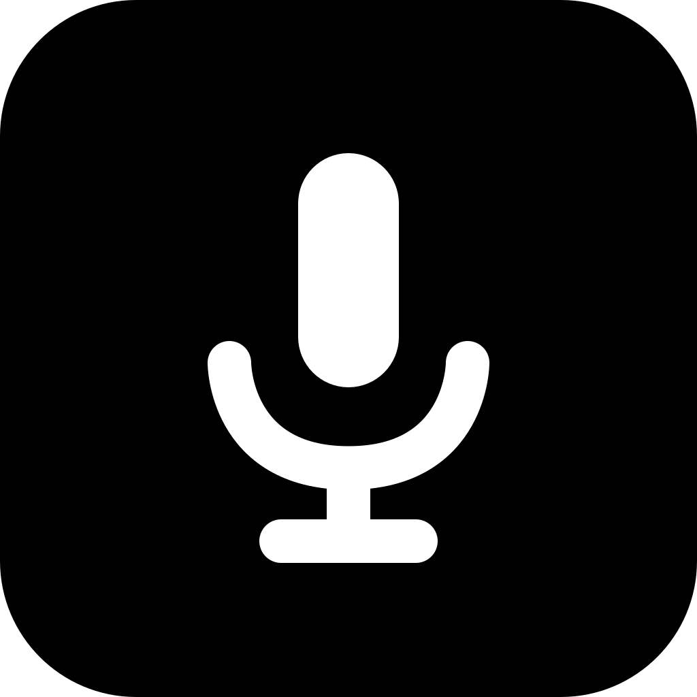

# Scriber

**Skip to:** [Download](#download) · [Build it yourself](#build-it-yourself) · [Repository layout](#repository)

If you're looking for a dictation app for macOS to daily-drive, you might be interested to check out [these alternatives I listed below](#better-alternatives) too.

I asked Codex and Claude to build a Wispr Flow alternative (didn't like its RAM usage). It's good enough that I uninstalled the other for the time being.

Scriber is a native macOS dictation app that lives in the menu bar by default, built with Swift, SwiftUI, and AppKit. Let me rephrase: Scriber is an ElevenLabs Scribe v2 API wrapper written in Swift that works just like Wispr Flow (kinda).

- ~100MB of idle RAM usage, <5MB of bundle size (native Swift app)
- BYOK (only supports ElevenLabs, for now)
- Auto-paste with paste-fail detection (jargon-y enough?)
- (currently) Does one job: record -> transcribe -> paste; that's it.

## Why ElevenLabs?

Its Scribe v2 model is not just benchmark-accurate (lowest WER in the world at some point), but also covers my personal use cases:

- handles Bahasa Indonesia well, even when quickly code-switching between it and English (a.k.a. *Jaksel-friendly*. Whisper does this too, but only to a certain extent with less accuracy)
- knows way more key terms and phrases internally than other providers like Deepgram and local models, including Whisper (less editing)
- generous free monthly credits (for non-heavy dictation users like me, 10k credits, which equals 2h30m of transcription via API, is more than enough; I usually spend around 5k-8k credits/month)
- auto-punctuation, filler-word removal, and (slight) grammar correction work so well that it doesn't need any post-processing at all in most cases

## Why not local models?

I'm on a base model macbook. Running a local model means:

- Downloading 1+++GB model if I want a bigger model for better accuracy
- or sticking with small models (like Parakeet or Whisper small) or Apple's built-in dictation service: less accurate, some don't support language auto-detect, some doesn't support my language, etc.
- Uses a huge chunk of memory when transcribing (may be up to 4gigs with bigger, more accurate models). I have experienced a freeze on my macbook air m4 base when other resource-heavy apps are running.
- I don't dictate private or incriminating information; I just type it (not the incriminating one) or use pw manager's auto-fill for that, so I'm not worried my dictation being processed somewhere on a server.

## (Better) Alternatives...

I've been using Scriber for weeks, and it fits my simple needs just fine. While I might keep maintaining it (read: report bugs and ask for features & improvements to the clankers), I most likely don't have enough tokens to squash bugs and fulfill requests as much/as quick as an actual project with an actual dev. You might want to check out these personal recommendations of mine + open source options I discovered:

### [Wispr Flow](https://wisprflow.ai/)

Seriously, if you're okay with its privacy policy (just got updated after the new Notetaker feature shipped; and not bothered with its current contro), and how it may use >400MB of your RAM, just use Wispr Flow

- it's a trend-setter and used by many for a reason
- great ux, great onboarding, easy to use
- good accuracy+speed combo
- built-in cleanup post-processing is reliable
- free users get 2000 words/week on desktop, 1000 words/week on mobile. more than enough for many
- and yes, fully-functional iOS and Android apps (and afaik, syncs with all your devices if you subscribe); even though some secure (mobile banking) apps can't be accessed while its accessibility access is active
- aside from the word limit, most features (except for the history sync, command mode and synced scratchpad, afaik) are *not paywalled*.
- app-aware output style customization: email format, casual/formal/original style (lowercase for chats, polished grammar and capitalization for email/the rest, etc.), etc. and very easy to understand and configure
- now also has a meeting transcription feature called "Notetaker" with real-time notes, speaker diarization, and summary notes (which I believe includes your real-time jotted down notes as well)

### [Spokenly](https://spokenly.app/)

- supports numerous hosted, BYOK, and local models
- good UX (arguably better than Wispr Flow in some parts): smart paste, hold + toggle in one shortcut, etc. (Scriber v0.9.0 also has these now)
- defaults to ElevenLabs Scribe v2 (biased...)
- only uses ~150MB ram (on my mac)
- app-aware formatting, with a different approach to Wispr Flow: it lets users add and configure the "templates", customize where each one triggers, manually select it during/after dictating, and set a custom prompt for the post-processing, in contrast to Wispr Flow's approach of ready-made configs (can be confusing for normies or semi-normies like me, while Wispr Flow's settings are so easy to understand that your non-tech-y friends and family might be able to fully use and configure it given enough time)
- live mode (using realtime models)
- claude code & cowork, cursor, and codex integration via mcp (what?)
- cli

Ofc it comes with some caveats:

- unfamiliar settings UI
- so many features are not paywalled, except for the one I want to enable the most. it's sad that I must subscribe to select the option to have the dictation interface on the notch
- shipped with sane defaults, but you'll need to spend some time to learn all features and possible options/configurations
- *closed source*. I can't learn how it works (read: can't steal ideas from its code)
- It works almost in any app people mostly use, but not everywhere; can't paste into some text fields, like ~~Zed editor~~ and VS Code's new experimental markdown editor. I presume it's trying to determine the exact text field via AX tree or something, and when it can't find one, it just cannot paste it there, neither the first auto attempt nor the drag-to-insert works (even though it successfully detected which app). Update 2026-08-07: the dev updated it to work in Zed, but I found it not working in Raycast too, I suppose due to their strategy of not blindly pasting and making sure a text field exists and has focus first

I might go back to this if they made changes that let me use it in those apps (or all apps for that matter, like how Scriber is designed)

### [Cloudless Voice](https://www.cloudless.so/) (previously Onit)

- offline first
- has been around for a while, and I remember the guys being very helpful and responsive on Discord
- non-intrusive indicator pill (like Wispr Flow, but at the side)

### Open source alternatives

here are the ones I found; only really tested some. you can just check them out:

1. Blazing-fast local-first new-comer: [Talkify](https://usetalkify.app)
    - Uses macOS built-in speech recognition (comes with its quirks, although latest macOS local asr has noticeably improved esp. the auto-punctuation)
    - The dev boasted its speed, having the lowest latency, and IT DELIVERS
2. paid-turned-open-source: [https://github.com/Beingpax/VoiceInk](https://github.com/Beingpax/VoiceInk)
3. [freeflow](https://github.com/zachlatta/freeflow)
4. [unramble](https://github.com/mrinalwadhwa/unramble)

---

=========== BELOW IS AI SLOP ===========

## Download

### Requirements

- **macOS 26 Tahoe or newer.**
- **Apple silicon.**
- A free [ElevenLabs](https://elevenlabs.io/app/sign-up) account, for the API key Scriber asks for during setup.

[**Download the latest DMG**](https://github.com/gafiegarcia/scriber/releases/latest), open it, and drag Scriber to Applications. Or:

```bash
brew install --cask gafiegarcia/scriber/scriber
```

macOS will say Scriber was downloaded from the internet the first time you open it. That prompt is normal for anything not installed from the App Store. Scriber is signed with a Developer ID certificate and notarized by Apple, so you should never see a warning that it cannot be opened or that the developer cannot be verified — if you do, something is wrong and it is worth opening an issue.

Setup then asks for your ElevenLabs key, Microphone access, and Accessibility access. Scriber needs Accessibility because its whole job is typing into whatever app you are already in.

Scriber checks GitHub once a day for a newer version and tells you in the menu bar. It never installs anything on its own, and you can switch the check off in Settings → General.

## Repository

The app builds from the repository root: [`Scriber`](Scriber) is the app target, [`ScriberCore`](ScriberCore) the shared package with [`ScriberCoreTests`](ScriberCoreTests) beside it, and [`Branding`](Branding) the icon artwork. Docs live in [`docs`](docs):

- [Building](docs/BUILDING.md): prerequisites, signing, command-line builds, installing, and first launch.
- [Releasing](docs/RELEASING.md): notarization, the disk image, and publishing a download.
- [Product specification](docs/PRODUCT_SPEC.md): required behavior and durable product decisions.
- [Roadmap](docs/ROADMAP.md): unbuilt work, grouped by target version.
- [Paste engine](docs/PASTE_ENGINE.md): cross-app delivery design and its regression matrix.
- [Manual checks](docs/MANUAL_CHECKS.md) and [automated checks](docs/AUTOMATED_CHECKS.md): the two verification passes.
- [Versioning policy](docs/VERSIONING.md): how versions, builds, and tags differ.

The Xcode project is the source of truth for the bundle build number. See the [changelog](CHANGELOG.md) for released snapshots.

## Build it yourself

You don't have to — [the download](#download) is the easy path. But if you want to build it yourself, you need Xcode 27 beta and a **free** Apple ID; a paid developer account is not required to build. Create `Signing.local.xcconfig` in root with your own team identifier, then build the **Debug** configuration:

```text
DEVELOPMENT_TEAM = ABCDE12345
```

Xcode shows that identifier under Settings → Accounts → Manage Certificates. The file is gitignored, so it stays yours.

Expect one thing that isn't a broken build: **macOS asks for your login Keychain password** the first time each freshly built binary reads the stored API key. An `Apple Development` signature changes identity on every build, so each new binary is a stranger to the stored key. Released builds don't have this problem — their Developer ID signature is stable.

**The Release configuration won't work for you.** It signs with my Developer ID certificate. Build Debug.

The [build guide](docs/BUILDING.md) has the full detail: prerequisites, command-line builds, verification, installation, and first launch. [Releasing](docs/RELEASING.md) covers signing, notarization, and publishing.

## If you fork it

The bundle identifier `com.gafiegarcia.scriber` is hardcoded in more places than `Info.plist`. Change it in all of them, or your fork will read and write the same login Keychain item my build does:

- `Scriber/Info.plist`
- `Scriber/KeychainStore.swift` — the Keychain service name
- `Scriber/AudioRecorder.swift` — the capture queue label
- `Scriber/OtherAudioMuteService.swift` — the aggregate device identifier
- `Scriber/PasteService.swift`, `ScriberApp.swift`, `AppCoordinator.swift`, and `LaunchAtLoginService.swift` — logging subsystems
- `PRODUCT_BUNDLE_IDENTIFIER` in both configurations of the Xcode target

[`PRODUCT_SPEC.md`](docs/PRODUCT_SPEC.md) is the one to read first if you plan to change anything.

## Issues and contributions

Bug reports and ideas are welcome. Development is real but slow — this is one person's daily-driver tool, built with a $20 token budget rather than a team, so expect slow progress. Fork freely.

## License

[MIT](LICENSE), copyright © 2026 Gafie Garcia. The app declares no third-party dependency: it uses only Apple's own frameworks.
