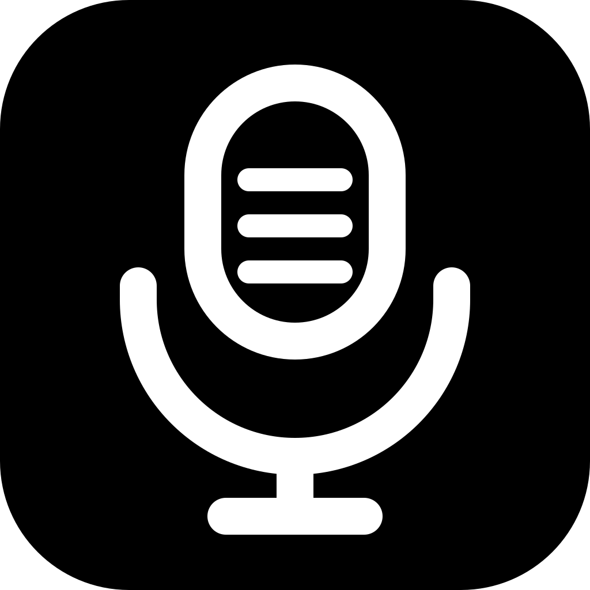

# Scriber

> **Source only** — no downloadable build; see [Build it yourself](#build-it-yourself).
> Issues are open, but replies aren't promised.

If you're looking for a dictation app for macOS to daily-drive, you might want to check out [these alternatives I listed below](#better-alternatives) first (unless you're curious enough to build this yourself and try it out).

I asked Codex and Claude to build a Wispr Flow alternative (didn't like its RAM usage). Scriber is a native macOS dictation app that lives in the menu bar by default, built with Swift, SwiftUI, and AppKit. Let me rephrase: Scriber is an ElevenLabs Scribe v2 API wrapper written in Swift that works just like Wispr Flow (mostly).

- <100MB of RAM usage
- BYOK (only supports ElevenLabs)
- Auto-paste with paste-fail detection (jargon-y enough?)

## Why ElevenLabs?

Its Scribe v2 model is not just benchmark-accurate, but also covers my personal use cases:

- handles Bahasa Indonesia well, even when quickly code-switching between it and English (a.k.a. *Jaksel-friendly*; Whisper does this too, but only to a certain extent with less accuracy)
- knows way more key terms and phrases internally than other providers like Deepgram and local models, including Whisper
- generous free monthly credits (for non-heavy dictation users, 10k credits, which equals 2h30m of transcription via API, just won't run out for me)
- auto-punctuation, filler-word removal, and (slight) grammar correction work so well that it doesn't need any post-processing at all (unless you need context-aware refinement, like querying text on the screen/around the cursor to give context to the post-processing AI, which I don't need)

## (Better) Alternatives...

I've been personally using Scriber for weeks, and the latest version accommodates my simple, not-too-frequent needs just fine. While I might keep maintaining it (read: report bugs and ask for features & improvements to tha clankers) and using it personally as I haven't found one I really like among the available free Wispr Flow alternatives I managed to find, I most likely don't have enough tokens to squash bugs and fulfill requests as much/as fast as an actual project with an actual dev. You might want to check out these personal recommendations of mine + open source options I discovered:

### [Wispr Flow](https://wisprflow.ai/)

Seriously, if you're okay with its privacy policy (just got updated after the new Notetaker feature shipped), and how it uses >400MB of your RAM even when idle, just use Wispr Flow

- it's a trend-setter and used by many for a reason
- great ux, great onboarding, easy to use
- good accuracy+speed combo
- built-in cleanup post-processing is reliable
- free users get 2000 words/week on desktop, 1000 words/week on mobile. more than enough for many
- aside from the word limit, most features (except for the history sync, command mode and synced scratchpad, as far as I remember) are *not paywalled*.
- app-aware transcription style customization. email format, casual/formal/original style (lowercase for chats, polished grammar and capitalization for email/the rest, etc.), etc. and very easy to understand and configure
- now also has a meeting transcription feature called "Notetaker" with real-time notes, speaker diarization, and summary notes (which I believe includes your jotted down notes as well)

### [Spokenly](https://spokenly.app/)

- ~~what I currently use~~ (see the last caveat below)
- supports hosted, BYOK, and local models
- good UX (arguably better than Wispr Flow in some parts): smart paste, hold + toggle in one shortcut, etc.
- defaults to ElevenLabs Scribe v2 (biased...)
- only uses ~150MB ram (on my mac)
- app-aware formatting, with a different approach to Wispr Flow: it lets users add and configure the "templates", customize where each one triggers, manually select it during/after dictating, and set a custom prompt for the post-processing, in contrast to Wispr Flow's approach of ready-made configs (can be confusing for normies or semi-normies like me, while Wispr Flow's settings are so easy to understand that your non-tech-y friends and family might be able to fully use and configure it given enough time)
- live mode (using realtime models)
- claude code & cowork, cursor, and codex integration via mcp (what?)
- cli

Ofc it comes with some caveats:

- unfamiliar settings UI
- so many features are not paywalled, except for the one I want to enable the most. it's sad that I must subscribe to select the option to have the dictation interface on the notch
- shipped with sane defaults, but you'll need to spend some time to learn all features and possible options/configurations
- *closed source*. I can't learn how it works (read: can't steal ideas from its code)
- It works almost in any app people mostly use, but not everywhere; can't paste into some text fields, like ~~Zed editor~~ and VS Code's new experimental markdown editor. I presume it's trying to determine the exact text field via AX tree or something, and when it can't find one, it just cannot paste it there, neither the first auto attempt nor the drag-to-insert works (even though it successfully detected which app). Update 2026-08-07: the dev updated it to work in Zed, but I found it not working in Raycast too, I suppose due to their strategy of not blindly pasting and making sure a text field exists and has focus first

I might go back to this if they made changes that let me use it in those apps (or all apps for that matter, like how Scriber is designed)

### Open source alternatives

here are the ones I found. tried some, but not really tested. you can just check them out

1. paid-turned-open-source: [https://github.com/Beingpax/VoiceInk](https://github.com/Beingpax/VoiceInk)
2. [freeflow](https://github.com/zachlatta/freeflow) 
3. [unramble](https://github.com/mrinalwadhwa/unramble)

---

=========== BELOW IS AI SLOP ===========

## Repository

- [`apps/macos`](apps/macos) contains the app. It is the only implementation.

Scriber started as an Electron/Next.js app and was rewritten in Swift. That
earlier implementation stopped at `0.6.0` and is no longer in the tree. It
remains in Git history; `v0.8.6` is the last tag whose tree still contains it.

The native line continues the product version after Electron `0.6.0`. The Xcode
project is the source of truth for the bundle build number. See the
[changelog](CHANGELOG.md) for released snapshots and the
[versioning policy](docs/VERSIONING.md) for how versions, builds, and tags differ.

## Build it yourself

There is no download. The app needs Accessibility and Microphone access to do
its job, and shipping a build without a paid Apple Developer ID means macOS
greets everyone with a scary warning — so you build it.

You need macOS 27 and Xcode 27 beta. A **free** Apple ID is enough; you do not
need a paid developer account. Create `apps/macos/Signing.local.xcconfig` with
your own team identifier, then build the **Debug** configuration:

```text
DEVELOPMENT_TEAM = ABCDE12345
```

Xcode shows that identifier under Settings → Accounts → Manage Certificates.
The file is gitignored, so it stays yours.

Two things to expect, neither of which means the build is broken:

- **macOS asks for your login Keychain password** the first time each freshly
  built binary reads the stored API key. Choose **Always Allow**. This is what
  a paid Developer ID would fix, and it's why the roadmap still lists one.
- **The Release configuration won't work for you.** It signs with a local
  certificate that exists only on my machine, so Release is my install path,
  not yours. Build Debug.

If you'd rather not involve an Apple ID at all, ad-hoc signing
(`CODE_SIGN_IDENTITY="-"`) builds a working app — but its signature changes on
every build, so macOS treats each one as a brand-new app and makes you re-grant
Accessibility and Microphone every single time. For an app whose whole point is
a global shortcut that types into other apps, that gets old fast.

The [native README](apps/macos/README.md) has the full detail: prerequisites,
command-line builds, verification, installation, and first launch.

## If you fork it

The bundle identifier `com.gafiegarcia.scriber` is hardcoded in more places than
`Info.plist`. Change it in all of them, or your fork will read and write the
same login Keychain item my build does:

- `apps/macos/Scriber/Info.plist`
- `apps/macos/Scriber/KeychainStore.swift` — the Keychain service name
- `apps/macos/Scriber/AudioRecorder.swift` — the capture queue label
- `apps/macos/Scriber/PasteService.swift` and `ScriberApp.swift` — logging
  subsystems
- `PRODUCT_BUNDLE_IDENTIFIER` in both configurations of the Xcode target

Required behavior, unbuilt ideas, and the verification checks live under
[`apps/macos/docs`](apps/macos/docs). `PRODUCT_SPEC.md` is the one to read first
if you plan to change anything.

## Issues and contributions

Bug reports and ideas are welcome. Development is real but slow — this is one
person's daily-driver tool, built with a $20 token budget rather than a team, so
expect slow progress. Fork freely.

## License

[MIT](LICENSE), copyright © 2026 Gafie Garcia. The app declares no third-party
dependency: it uses only Apple's own frameworks.
